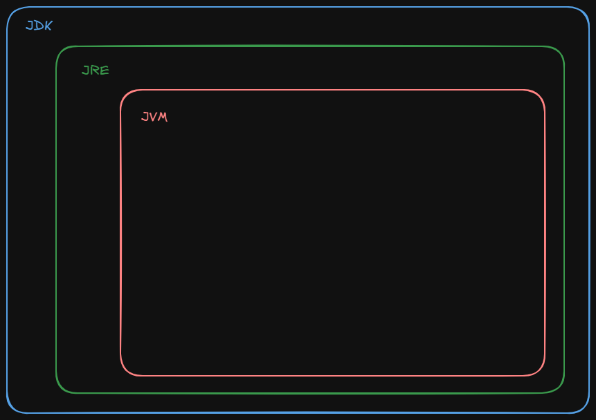
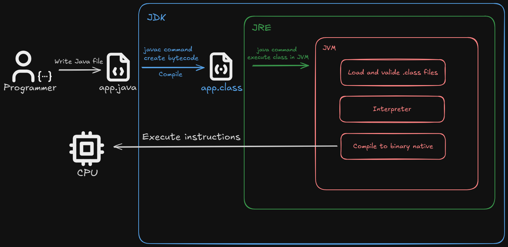

## Java Fundaments

### What is JDK, JRE and JVM 🤯

- **JDK (Java Develpment Kit)**: It is a developer kit that includes tools such as javac (compiler), java (interpreter), and additional utilities to create, compile, and debug Java programs. 

- **JRE (Java Runtime Environment)**: It includes the basic Java libraries and also helps us execute Java code.

- **JVM (Java Virtual Machine)**: It is a virtual machine that runs Java bytecode on any operating system.

### Relationship between JDK, JRE and JVM

### Key Tools of Java 

| Tool         | Belongs to | Description   |
| --------     | -------    | -------       |
| **javac**    | JDK	    | Java source code to bytecode compiler         |
| **java**	   | JRE	    | Interpreter that executes bytecode on the JVM |
| **jar**      | JDK	    | Tool for packaging Java applications          |
| **javadoc**  | JDK	    | HTML Documentation Generator                  |
| **jdb**      | JDK	    | Java Application Debugger                     |

### Advantages of Java Environment Design

- Write Once, Run Anywhere (WORA): We write the code only once and it can be interpreted on any operating system that has a JVM installed.

### Overview of the life cycle of a Java program

1) **Write**: Create source code (.java)
2) **Compile**: Convert source code to bytecode (.class) with javac
3) **Execute**: The JVM interprets the bytecode and executes it on the operating system

