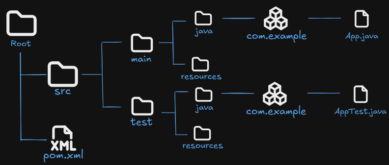

## Generate Maven Project

To create a Maven project, you use the **mvn archetype:generate** command, which allows you to generate a project structure based on an archetype. Here are the steps and details:

```
mvn archetype:generate
```

This command launches an interactive wizard where Maven asks for information about the project and the desired archetype.

Common parameters when generating a project:
- **DgroupId**: Defines the group identifier of the project (usually the reverse domain of your organization or application, such as com.mycompany).
- **DartifactId**: This is the unique name of the project or module.
- **Dversion**: Defines the version of the project. By default, it is 1.0-SNAPSHOT.
- **DarchetypeArtifactId**: Specifies the archetype to be used as a template.

We can send the project information using parameters as in the following command:

```
mvn archetype:generate \
  -DgroupId=com.dachser \
  -DartifactId=simple-maven \
  -Dversion=1.0 \
  -DarchetypeArtifactId=maven-archetype-simple \
  -DarchetypeVersion=1.5 \
  -DinteractiveMode=false
```

Maven generates the project with the following structure:



---

### Important: Update the Generated pom.xml

The archetypes generate projects with **outdated default versions**. After generating the project, you should update the `pom.xml` to use modern versions.

#### Problems with the generated pom.xml:

| What | Generated (outdated) | Recommended |
|------|---------------------|-------------|
| Java version | `<maven.compiler.source>8</maven.compiler.source>` | `17` (or your project's version) |
| JUnit version | JUnit 3.8.1 (`junit:junit`) | JUnit 5 (`org.junit.jupiter:junit-jupiter`) |
| JUnit scope | Missing `<scope>test</scope>` | Should be `test` |
| FIXME comment | `<!-- FIXME change it to the project's website -->` | Remove or update |

#### Updated pom.xml:

```xml
<?xml version="1.0" encoding="UTF-8"?>
<project xmlns="http://maven.apache.org/POM/4.0.0" xmlns:xsi="http://www.w3.org/2001/XMLSchema-instance"
  xsi:schemaLocation="http://maven.apache.org/POM/4.0.0 http://maven.apache.org/xsd/maven-4.0.0.xsd">
  <modelVersion>4.0.0</modelVersion>

  <groupId>com.dachser</groupId>
  <artifactId>simple-maven</artifactId>
  <version>1.0</version>

  <name>simple-maven</name>
  <description>A simple Maven project.</description>

  <properties>
    <project.build.sourceEncoding>UTF-8</project.build.sourceEncoding>
    <maven.compiler.source>17</maven.compiler.source>
    <maven.compiler.target>17</maven.compiler.target>
  </properties>

  <dependencies>
    <dependency>
      <groupId>org.junit.jupiter</groupId>
      <artifactId>junit-jupiter</artifactId>
      <version>5.10.1</version>
      <scope>test</scope>
    </dependency>
  </dependencies>

  <build>
    <pluginManagement>
      <plugins>
        <plugin>
          <artifactId>maven-clean-plugin</artifactId>
          <version>3.4.0</version>
        </plugin>
        <plugin>
          <artifactId>maven-compiler-plugin</artifactId>
          <version>3.13.0</version>
        </plugin>
        <plugin>
          <artifactId>maven-surefire-plugin</artifactId>
          <version>3.3.0</version>
        </plugin>
        <plugin>
          <artifactId>maven-jar-plugin</artifactId>
          <version>3.4.2</version>
        </plugin>
        <plugin>
          <artifactId>maven-install-plugin</artifactId>
          <version>3.1.2</version>
        </plugin>
        <plugin>
          <artifactId>maven-deploy-plugin</artifactId>
          <version>3.1.2</version>
        </plugin>
      </plugins>
    </pluginManagement>
  </build>
</project>
```

#### Updated test class (JUnit 5):

The generated test class uses JUnit 3 style (`extends TestCase`). Update it to JUnit 5:

```java
package com.dachser;

import org.junit.jupiter.api.Test;
import static org.junit.jupiter.api.Assertions.assertTrue;

/**
 * Unit test for simple App.
 */
class AppTest {

    @Test
    void testApp() {
        assertTrue(true);
    }
}
```

Key differences between JUnit 3 and JUnit 5:
- No need to `extend TestCase`
- Use `@Test` annotation instead of naming methods `testXxx`
- Use `org.junit.jupiter.api` package instead of `junit.framework`
- Test classes and methods don't need to be `public`

**NOTE**: This is a clear example of why the Maven Archetypes section (02-maven-archetypes) warns against using archetypes for modern projects. The templates are often outdated. Tools like [Spring Initializr](https://start.spring.io/) generate projects with current versions out of the box.
